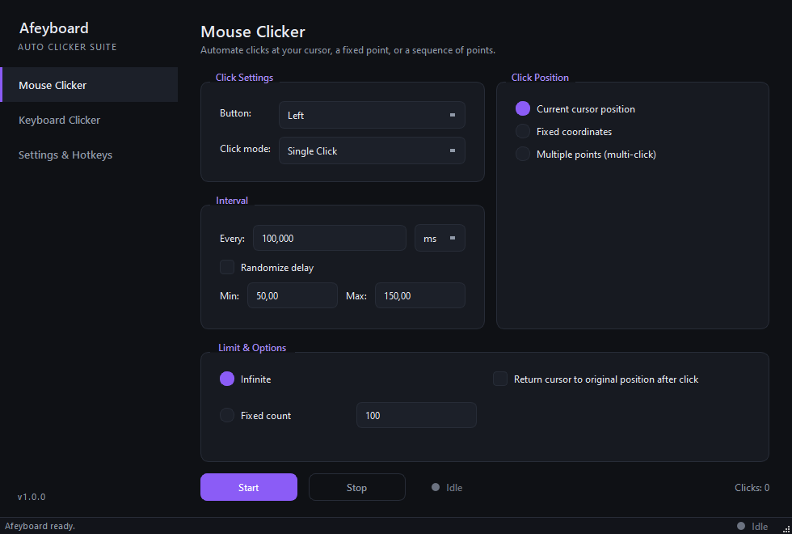
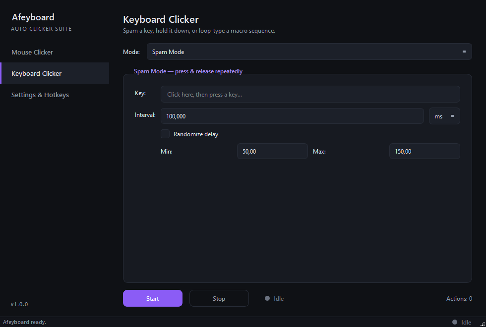
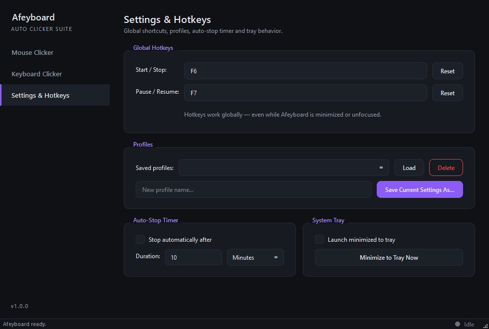

# Afeyboard

Professional combined mouse + keyboard auto-clicker with a modern dark-mode UI, built with Python, PyQt6 and pynput.



## Features

### Mouse Clicker
- Button: Left / Right / Middle / Side 1 / Side 2
- Click mode: Single or Double click
- Interval in ms or s, with optional randomized min/max delay
- Click position: current cursor, a fixed X/Y point, or a list of multiple points (multi-click) — all pickable by clicking anywhere on screen
- Click limit: infinite or a fixed count
- Optional "return cursor to original position after click"

### Keyboard Clicker
- **Spam mode** — press/release a key repeatedly at a set interval (with optional randomization)
- **Hold mode** — press and hold a key for a set duration
- **Macro mode** — loop-type a block of text at a set interval
- Key selection via a global-style key-capture field (supports modifier combos, e.g. `Ctrl+Alt+P`)

### Settings & Hotkeys
- Global hotkeys for Start/Stop (default `F6`) and Pause/Resume (default `F7`) — work even when the app is unfocused or minimized
- Profiles — save/load/delete named Mouse + Keyboard configurations as JSON
- Auto-stop timer — automatically stop after N minutes/seconds
- System tray — launch minimized, minimize on demand, closing the window keeps Afeyboard running in the tray until you Quit from the tray menu

Global hotkeys act on whichever page (Mouse or Keyboard) is currently open.

## Screenshots

| Mouse Clicker | Keyboard Clicker | Settings & Hotkeys |
|---|---|---|
|  |  |  |

## Tech stack

- Python 3.10+
- [PyQt6](https://pypi.org/project/PyQt6/) — UI
- [pynput](https://pypi.org/project/pynput/) — global mouse/keyboard simulation and hotkey listening

## Project structure

```
main.py                        entry point
app/
  config.py                    constants, enums, paths
  core/                        pure logic — no Qt widgets
    mouse_clicker.py           MouseClickerWorker, PointPicker (QThread + pynput)
    keyboard_clicker.py        KeyboardClickerWorker (spam/hold/macro)
    hotkey_manager.py          global Start/Stop + Pause/Resume hotkeys
    profile_manager.py         profile + app-settings JSON persistence
  ui/
    main_window.py             sidebar + pages + tray + wiring
    sidebar.py, style.py, widgets.py
    pages/
      mouse_page.py, keyboard_page.py, settings_page.py
profiles/                      saved profiles (git-ignored, except .gitkeep)
```

Mouse/keyboard simulation logic (`app/core`) is fully decoupled from the UI (`app/ui`) and runs on background `QThread`s, so the interface never freezes while a clicker is running.

## Getting started

```bash
python -m venv .venv
.venv\Scripts\activate        # Windows
# source .venv/bin/activate   # macOS/Linux

pip install -r requirements.txt
python main.py
```

### Building a standalone .exe (Windows)

```bash
pip install pyinstaller
pyinstaller --noconfirm --onefile --windowed --name Afeyboard --icon=assets/icon.ico main.py
```

Output: `dist/Afeyboard.exe` — a single-file executable, no Python install required on the target machine.

Windows is the primary target platform; the app also runs on macOS/Linux via pynput, though OS-level permissions (e.g. macOS Accessibility access, or side mouse button support) may vary.

## Notes

- Numeric fields use spin boxes, so invalid (non-numeric) input can't be typed in; malformed or hand-edited profile/settings JSON is caught and reported without crashing the app.
- Profiles are stored under `profiles/*.json` (git-ignored by default).

## License

MIT — see [LICENSE](LICENSE).
